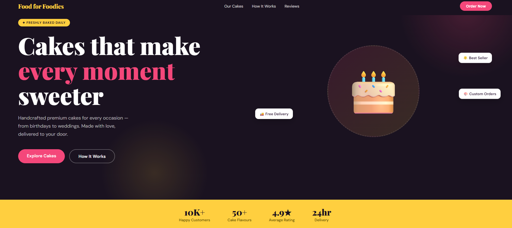
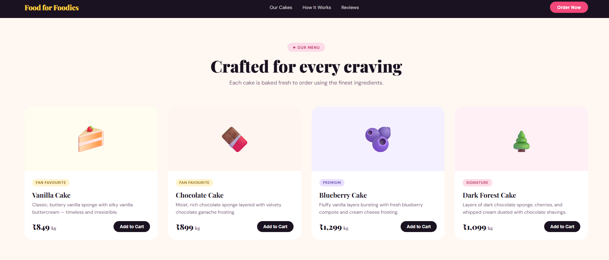
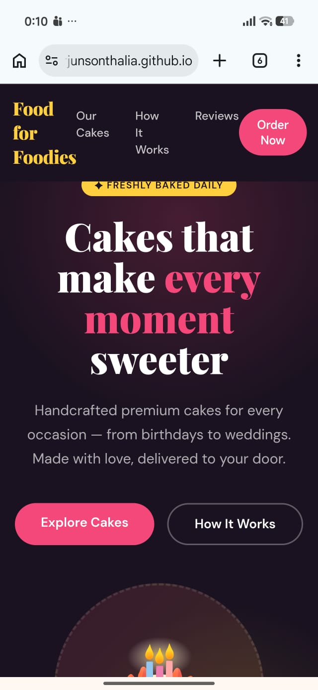

# 🍰 Food for Foodies – Premium Bakery Website

A modern and responsive bakery landing page built using **HTML** and **CSS**.
This project showcases a premium cake business website with beautiful UI sections, smooth layouts, and vibrant styling.

---

## ✨ Features

* 🎂 Elegant bakery-themed landing page
* 📱 Fully responsive design
* 🎨 Modern UI with custom color palette
* 🍰 Featured cakes section
* ⭐ Customer testimonials
* 🚚 Delivery & ordering process section
* 💖 Smooth hover animations and transitions
* 🧁 Attractive hero section with call-to-action buttons

---

## 🛠️ Technologies Used

* HTML5
* CSS3
* Google Fonts

---

## 📸 Screenshots

### 🏠 Hero Section



### 🍰 Cakes Menu



### ⭐ Reviews Section


### 📱 Mobile Responsive View



---

## 📂 Project Structure

```bash
Food-for-Foodies/
│
├── index.html
├── screenshots/
│   ├── hero.png
│   ├── cakes.png
│   ├── reviews.png
│   └── mobile.png
└── README.md

---

## 🎨 Design Highlights

* Playfair Display typography for elegant headings
* Soft pastel bakery color palette
* Floating animations for hero visuals
* Card hover effects for cakes and testimonials
* Fixed navigation bar with smooth scrolling

---

## 👨‍💻 Author

Made with ❤️ by **Arjun**

---
